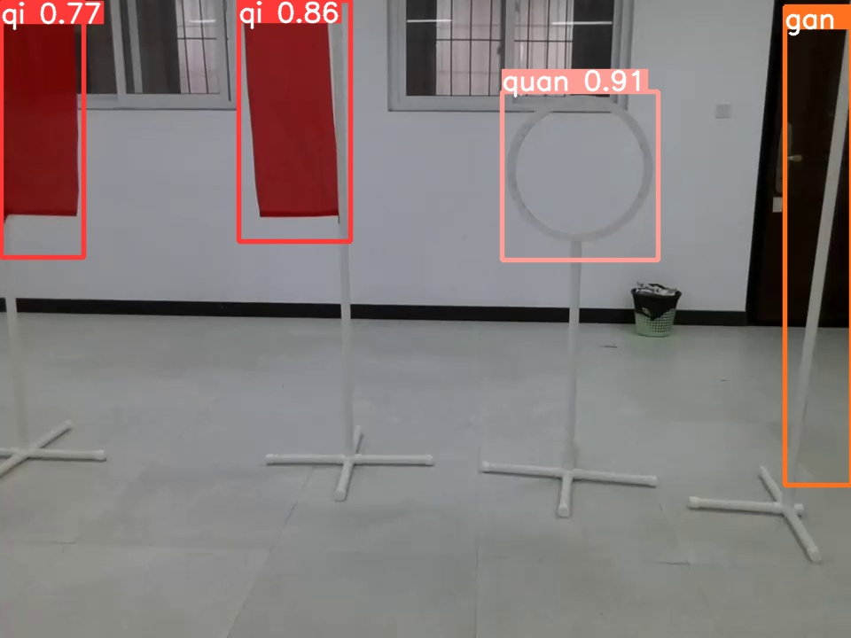

# 基于yolov5框架和大疆教育无人机Tello TT 实现目标识别测距追踪
# 提供训练好的模型，调用方法如下：
## 模型加载
model = DetectApi(weights=['.\\yolov5_new\\weights\\best.pt'], nosave=False)
## 目标检测
img_path = '.\\img\\20.jpg'  #待检测图片
res = model.detect(source=img_path)

print(res)  #显示检测结果

识别后的结果默认存放在yolov5_new/runs/detect/exp*文件夹下

效果如下：

